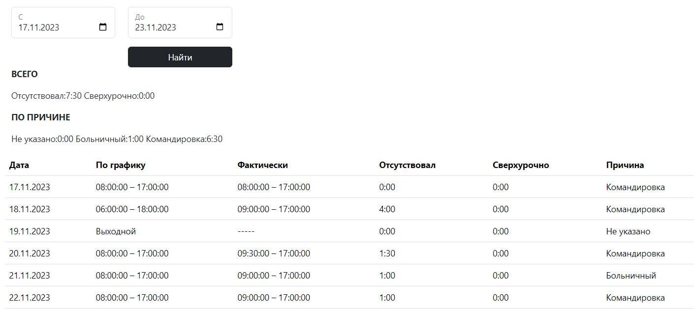

# Employee work time
## Учет рабочего времени сотрудников

---
### 1. Описание

* Создание, редактирование и удаление информации о сотрудниках
* Создание и редактирование трудовых договоров
    * Учет срока действия контракта (бессрочный/на определенное время)
* Создание графиков работы сотрудников
    * Различные типы графиков (фиксированный/сменный)
* Добавление исключительных дней, влияющих на график работы одного или нескольких сотрудников
* Добавление отчетов о рабочем времени сотрудников с указанием причины отсутствия
* Получение подробной информации за любой указанный период времени. Общий и по дням.

### 2. Запуск

1. Укажите пароль и логин от PostgreSQL в application.properties
2. Создайте БД employeeworktime или измените название в application.properties
3. Запустите приложение, liquibase создаст необходимые таблицы
4. Для добавления данных в БД Вы можете запустить sql скрипт из resources/db/sql
5. Для запуска тестов необходимо изменить логин, пароль, название бд в test/resources/integration-tests.properties